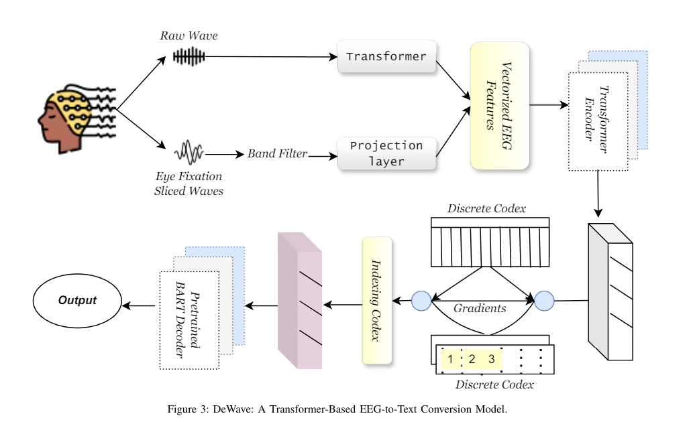

5-9-24 4:57 am

- #### What are the specific techniques used to decode text from EEG brain signals?

  - Coherence: This technique measures the degree of correlation between the activities of different brain regions in the frequency domain, providing insights into the functional relationships and synchronization patterns between various regions.

  - Phase synchronization: This evaluates the temporal alignment of neural oscillations across different regions, revealing intricate patterns of neural communication crucial for cognitive and motor functions.

  - Deep neural networks: Specifically, recurrent neural networks (RNNs) and Long Short-Term Memory (LSTM) networks have demonstrated significant potential in decoding EEG signals into text.

  - Bidirectional Auto-Regressive Transformers (BART): Known for its effectiveness in natural language processing tasks, BART is being adapted to interpret and convert EEG signals into text.

- #### What are the challenges in EEG Signal Decoding for Text Generation ?

  - acquiring proper brain wave data :
    - acquiring clean and proper brain wave data is crucial for efficient thought to text genegration
    - ###### problems are:
      - EEG waves are non stationary i.e. they frequently tend to change, extracting features and information from this changing waves is challenging.
      - EEG waves are high dimensional and constains redunt information cleaning this is a complex task.
      - calibrating EEG device to individual user is essential for accurately decoding neural signals is time consuming.
      - training data is limited.
      - privacy concerns related to the user advance encryptions are required to protect the data.

- #### is there any currently availabel models that can decdode thought to text?
  - raw input : - the raw data i.e. brain electrical activity is recorded
    
